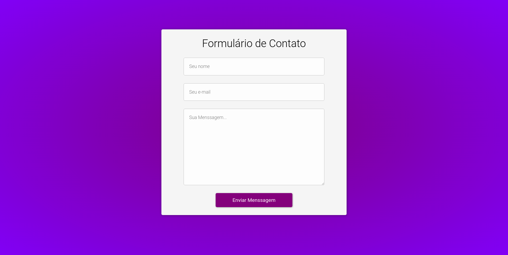

<table align="right">
  <tr>
    <td>
      <a href="readme-en.md">🇺🇸 English</a>
    </td>
  </tr>
  <tr>
    <td>
      <a href="README.md">🇧🇷 Português</a>
    </td>
  </tr>
</table>
<br>

# 🧾 Functional Contact Form



> Acesse o projeto [AQUI](https://luk4x.github.io/projeto-formulario-de-contato/)

## 📝 Sobre

> Assistir o vídeo acima e/ou acessar o projeto online ajudará na compreensão da explicação!

A PlayStation Store é uma aplicação web que simula a vitrine de um e-commerce de periféricos relacionados ao PlayStation 5.<br>
Meu maior foco durante o desenvolvimento foi aperfeiçoar minha semântica e discernimento ao lidar com HTML, e minha maestria em CSS ao utilizar de MediaQueries, flexbox e etc... para deixar o projeto o mais bem trabalho possível.<br>
Utilizando os serviços da [FormSubmit](https://formsubmit.co/), eu também acabei desenvolvendo um formulário que realmente funciona na aba de suporte da aplicação.

### 📌 Alguns Destaques

- Formulário funcional;
- Responsividade;
- HTML Semântico;
- CSS Flexbox;

## 📖 Clonando o Projeto

Para clonar e executar este projeto em seu computador, você precisará apenas que o [Git](https://git-scm.com/) esteja previamente instalado.<br>
Feito isso, no terminal:

```bash
# Clone esse repositório com:
> git clone https://github.com/Luk4x/projeto-formulario-de-contato.git

# Entre no repositório com:
> cd projeto-formulario-de-contato

# Execute o projeto com:
> start index.html # Para usuários de Windows
> open index.html # Para usuários de Linux/Mac
```

## 🤝 Contato dos Contribuintes

<table>
  <tr>
    <td align="center">
      <a href="https://www.linkedin.com/in/lucasmacielf/">
        <br>
        <sub>
          <b>Lucas Maciel</b>
        </sub>
      </a>
    </td>
  </tr>
</table>
